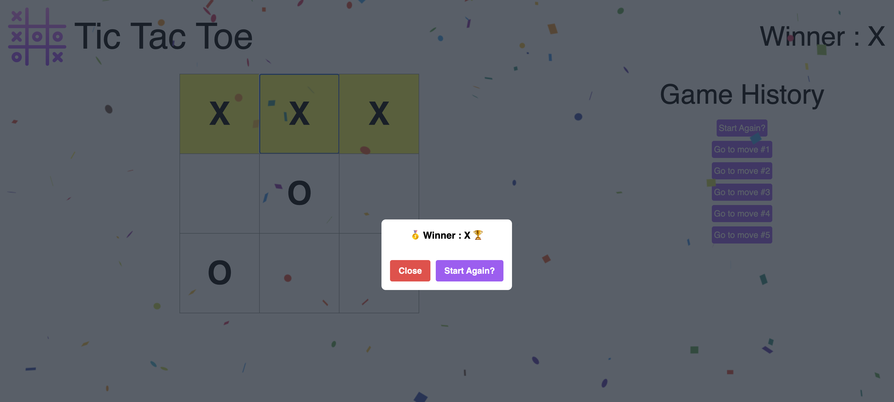

# Tic Tac Toe - React

  

## What is this project about? 🤔
This project is a Tic Tac Toe game developed using React and styled with Tailwind CSS. It originated from the official React Dev tutorial for Tic Tac Toe (https://react.dev/learn/tutorial-tic-tac-toe#overview) but has evolved with additional features, making it unique and more engaging.

## Key Features and Improvements 🚀
* Enhanced Visuals: Tailwind CSS has been integrated to give the game a polished and modern appearance.
* Responsive Design: The game is now mobile-friendly, allowing users to enjoy it on various devices.
* Exciting Animations: Implemented animations using the `react-confetti` library to add a fun and celebratory touch when a player wins the game.
* Victory & Draw Indicators: Clear messages are displayed to the user when a player wins or if the game results in a draw, enhancing the user experience.

## Demo 🎮
Check out the live demo of the Tic Tac Toe game [here](https://redwan-tic-tac-toe.netlify.app).

## Technologies Used 💻
The technologies utilized in this project are:
1. React
2. Tailwind CSS
3. `react-confetti` (Library used for the confetti animation)

## Try It Out! 🕹️
Feel free to give it a try and enjoy some Tic Tac Toe fun with this improved and feature-rich version!

Your feedback and suggestions for further enhancements are always welcome! 🙌